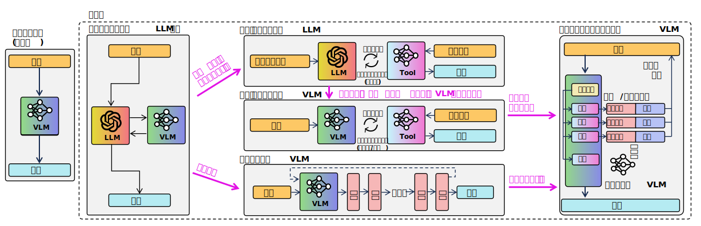

<html lang="ja">
    <head>
        <meta charset="utf-8" />
    </head>
    <body>
<h1>
Survey Papers
</h1>
<h2>なにものか？</h2>

　サーベイ論文 
　〇 特定の研究分野やテーマに関する既存の研究成果を体系的にまとめられている。 
　　 → 分野全体の動向や重要な研究成果を把握できる。 
　× 長くて訳すのが大変 
　　　　↓ 
　日本語で読めるサーベイ論文の要約を読むのが手っ取り早いのではないか ? 
　　　　↓ 
　サーベイ論文の要約を集めてみた。 
 
・キーワードのアルファベット順 
・発表時期はURLで西暦下位2桁＋月を確認できる

<h3>Agentic Reinforcement Learning (エージェント型強化学習)</h3>

<ul>
<li>The Landscape of Agentic Reinforcement Learning for LLMs: A Survey</li>
<li>LLMにおけるエージェント型強化学習の展望：サーベイ</li>
<li><a href="https://www.alphaxiv.org/ja/overview/2509.02547v1">https://www.alphaxiv.org/ja/overview/2509.02547v1</a></li>
<li>概要
<ul>
<li>
大規模言語モデル（LLM）向けのエージェント型強化学習（Agentic RL）を部分観測マルコフ決定過程（POMDP）として定式化し、従来のLLM-RLと区別しています。本論文は、エージェント能力とタスクドメイン別に進捗を分類する包括的な二重の分類法を提供し、将来の研究を導くためのオープンソースリソースを統合しています。
</li></ul>
</li></ul>

<h3>Agent Workflow (エージェント・ワークフロー)</h3>

<ul>
<li>A Survey on Agent Workflow -- Status and Future</li>
<li>エージェントワークフローに関する調査—現状と展望</li>
<li><a href="https://www.alphaxiv.org/ja/overview/2508.01186v1">https://www.alphaxiv.org/ja/overview/2508.01186v1</a></li>
<li>概要
<ul>
<li>
LLM駆動型エージェントワークフローシステムの現在の状況を体系的にマッピングし、20以上の学術フレームワークと産業実装をその機能的能力とアーキテクチャ機能によって分類している。これにより、普及しているパターン、標準化やセキュリティなどの分野における現在の限界が特定され、スケーラブルで制御可能かつ安全なAIの振る舞いを構築するための重要な将来の研究方向性が示されている。
</li></ul>
</li></ul>

<h3>AI Agents (AIエージェント), Autonomous Agents (自律エージェント)</h3>

<ul>
<li>A Comprehensive Review of AI Agents: Transforming Possibilities in Technology and Beyond</li>
<li>AIエージェントの包括的レビュー：テクノロジーとその先の可能性を拓く</li>
<li><a href="https://www.alphaxiv.org/ja/overview/2508.11957v1">https://www.alphaxiv.org/ja/overview/2508.11957v1</a></li>
<li>概要
<ul>
<li>
急速に進化するAIエージェントの状況を統合し、そのアーキテクチャ原則、コアコンポーネント、および多様なアプリケーションについて、包括的、体系的、かつアクセスしやすい概要を提供する
</li></ul>
 

<li>A Survey on Large Language Model based Autonomous Agents</li>
<li>大規模言語モデルに基づく自律エージェントに関するサーベイ</li>
<li><a href="https://www.alphaxiv.org/ja/overview/2308.11432v7">https://www.alphaxiv.org/ja/overview/2308.11432v7</a></li>
<li>概要
<ul>
<li>
大規模言語モデル（LLM）ベースの自律エージェントに関する包括的かつ体系的なレビューを提供
</li></ul>
 

<li>From LLM Reasoning to Autonomous AI Agents: A Comprehensive Review</li>
<li>LLMの推論から自律型AIエージェントへ：包括的なレビュー</li>
<li><a href="https://www.alphaxiv.org/ja/overview/2504.19678v1">https://www.alphaxiv.org/ja/overview/2504.19678v1</a></li>
<li>概要
<ul>
<li>
2019年から2025年までのフレームワークを分析し、エージェントコラボレーションプロトコルの詳細な比較を提供するとともに、材料科学、生物医学研究、ソフトウェアエンジニアリングなどの分野における主要な研究課題を特定する
</li></ul>
 
</li></ul>

<h3>AIoT: Artificial Intelligence of Things</h3>

<ul>
<li>Artificial Intelligence of Things: A Survey</li>
<li>AIoT：サーベイ</li>
<li><a href="https://www.alphaxiv.org/ja/overview/2410.19998v1">https://www.alphaxiv.org/ja/overview/2410.19998v1</a></li>
<li>概要
<ul>
<li>
モノの人工知能（AIoT）の体系的かつ包括的なレビューを提供し、その主要なコンポーネントとアプリケーションを詳細に説明しています。AIを活用したセンシング、AI指向のコンピューティング、AI強化されたネットワーキング＆通信における進歩を統合し、ディープラーニング、基盤モデル、生成AIといった現代AI技術がIoTの能力を変革する影響を示しています。
</li></ul>
</li></ul>

<h3>automated scholarly paper review (自動査読)</h3>

<ul>
<li>Large language models for automated scholarly paper review: A survey</li>
<li>大規模言語モデルによる学術論文の自動査読：サーベイ</li>
<li><a href="https://www.alphaxiv.org/ja/overview/2501.10326v1">https://www.alphaxiv.org/ja/overview/2501.10326v1</a></li>
<li>概要
<ul>
<li>
学術論文の自動査読（ASPR）における大規模言語モデルの活用に関する現在の状況を包括的に調査している
</li></ul>
</li></ul>

<h3>Automatic Text Summarization (自動要約)</h3>

<ul>
<li>A Comprehensive Survey on Process-Oriented Automatic Text Summarization with Exploration of LLM-Based Methods</li>
<li>プロセス指向型自動テキスト要約に関する包括的総説：LLMに基づく手法の検討</li>
<li><a href="https://www.alphaxiv.org/ja/overview/2403.02901v2">https://www.alphaxiv.org/ja/overview/2403.02901v2</a></li>
<li>概要
<ul>
<li>
自動テキスト要約（ATS）の進化を、従来の統計的手法や深層学習手法から、最近の大規模言語モデル（LLM）ベースのアプローチまでマッピングし、LLM技術の詳細な分析を提供し、文献検索のための新しいLLM拡張アルゴリズムを導入しています。
</li></ul>
</li></ul>

<h3>Autonomous Driving (自動運転), Deep Reinforcement Learning (深層強化学習)</h3>

<ul>
<li>Deep Reinforcement Learning for Autonomous Driving: A Survey</li>
<li>自動運転における深層強化学習：サーベイ</li>
<li><a href="https://www.alphaxiv.org/ja/overview/2002.00444v2">https://www.alphaxiv.org/ja/overview/2002.00444v2</a></li>
<li>概要
<ul>
<li>
自動運転のための深層強化学習（DRL）に関する自己完結型の概要を提供し、制御から高レベルのポリシー策定まで、様々なタスクにおけるその応用を体系的にレビューしています。本論文は、DRLが複雑な逐次的意思決定問題に対処する可能性を強調しつつ、シミュレーションと現実のギャップ、サンプル効率、堅牢な安全性統合の必要性といった重大な課題を詳細に記述し、この分野の将来の研究方向性を示しています。
</li></ul>
</li></ul>

<h3>Autoregressive Models (自己回帰モデル)</h3>

<ul>
<li>Autoregressive Models in Vision: A Survey</li>
<li>ビジョンにおける自己回帰モデル：サーベイ</li>
<li><a href="https://www.alphaxiv.org/ja/overview/2411.05902v1">https://www.alphaxiv.org/ja/overview/2411.05902v1</a></li>
<li>概要
<ul>
<li>
コンピュータビジョンにおける自己回帰モデルを体系的に分類し、ピクセルベースからトークンベースおよびスケールベースの表現への進化を詳しく説明しています。画像生成、ビデオ生成、3Dコンテンツ作成、マルチモーダル合成におけるその多様な応用を探り、他の生成モデルとの関係を議論し、現在の課題と将来の研究方向性を特定しています。
</li></ul>
</li></ul>

<h3>Compositional Visual Reasoning (構成的視覚推論)</h3>

<ul>
<li>Explain Before You Answer: A Survey on Compositional Visual Reasoning</li>
<li>説明してから回答せよ：構成的視覚推論に関するサーベイ</li>
<li><a href="https://www.alphaxiv.org/ja/overview/2508.17298v2">https://www.alphaxiv.org/ja/overview/2508.17298v2</a></li>
<li>概要
<ul>
<li>
構成的視覚推論（CVR）を定義し分類し、その手法の5段階の進化ロードマップを提案し、主要な課題と今後の研究方向性を概説しています。
</li></ul>
</li></ul>

<h3>Computer Vision, Transformer</h3>

<ul>
<li>Transformers in Vision: A Survey</li>
<li>画像分野におけるトランスフォーマー：サーベイ</li>
<li><a href="https://www.alphaxiv.org/ja/overview/2101.01169v5">https://www.alphaxiv.org/ja/overview/2101.01169v5</a></li>
<li>概要
<ul>
<li>
コンピュータビジョンにおけるTransformerモデルの包括的な概要を提供し、急速に拡大する文献をアーキテクチャ設計とタスクアプリケーション別に体系的に整理しています。NLPに起源を持つこれらのモデルが、分類、検出、セグメンテーションなど、様々なビジョンタスクで競争力のあるパフォーマンスを達成するためにどのように成功裏に適応されたかについて、調査結果を総合しています。
</li></ul>
</li></ul>

<h3>Continue Learning (継続学習)</h3>

<ul>
<li>When Continue Learning Meets Multimodal Large Language Model: A Survey</li>
<li>継続学習がマルチモーダル大規模言語モデルと出会うとき：サーベイ</li>
<li><a href="https://www.alphaxiv.org/ja/overview/2503.01887v1">https://www.alphaxiv.org/ja/overview/2503.01887v1</a></li>
<li>概要
<ul>
<li>
マルチモーダル大規模言語モデルにおける継続学習の急速に進化する分野を解明している。この研究は440の研究論文をレビューし、MLLMが動的に適応しながら壊滅的忘却を軽減するための進捗、課題、および将来の方向性に関する初の専門的な概要を提供している。
</li></ul>
</li></ul>

<h3>CoT: Chain-of-thoughts (思考連鎖)</h3>

<ul>
<li>Towards Reasoning Era: A Survey of Long Chain-of-Thought for Reasoning Large Language Models</li>
<li>推論時代に向けて：推論大規模言語モデルのための長いChain-of-Thoughtに関する調査</li>
<li><a href="https://www.alphaxiv.org/ja/overview/2503.09567v1">https://www.alphaxiv.org/ja/overview/2503.09567v1</a></li>
<li>概要
<ul>
<li>
大規模言語モデルにおけるLong Chain-of-Thought（Long CoT）推論の包括的な調査と分類法を提示し、深い推論、広範な探索、実行可能な反射といった主要な特性を検証しつつ、過度な思考やテスト時スケーリングなどの現象を分析している。
</li>
</ul>
 
<li>Multimodal Chain-of-Thought Reasoning: A Comprehensive Survey</li>
<li>マルチモーダル思考連鎖推論: 包括的調査</li>
<li><a href="https://www.alphaxiv.org/ja/overview/2503.12605v2">https://www.alphaxiv.org/ja/overview/2503.12605v2</a></li>
<li>概要
<ul>
<li>
マルチモーダル思考連鎖（MCoT）推論に関する初の包括的な調査であり、その進化、多様な方法論、および様々なモダリティにわたる応用を分析している。散在した研究を統合し、体系的な分類法を提供し、基礎概念を明確にし、マルチモーダルAIにおける革新を促進するための将来の研究方向性を特定する。
</li>
</ul>
</li></ul>

<h3>Deep Multimodal Learning (深層マルチ・モーダル学習), Missing Modality (欠損モダリティ)</h3>

<ul>
<li>Deep Multimodal Learning with Missing Modality: A Survey</li>
<li>欠損モダリティを伴う深層マルチモーダル学習：サーベイ</li>
<li><a href="https://www.alphaxiv.org/ja/overview/2409.07825v3">https://www.alphaxiv.org/ja/overview/2409.07825v3</a></li>
<li>概要
<ul>
<li>
欠損データを持つマルチモーダル学習のために設計された深層学習手法について、初の包括的なレビューを提供しています。多様なアプローチを分類するための新しいタクソノミーを提案し、この分野における主要な課題と今後の研究方向性を特定しています。
</li></ul>
</li></ul>

<h3>Detection of Rumors (うわさ検出)</h3>

<ul>
<li>Detection of Rumors and Their Sources in Social Networks: A Comprehensive Survey</li>
<li>ソーシャルネットワークにおける噂とその情報源の検出：包括的なサーベイ</li>
<li><a href="https://www.alphaxiv.org/ja/overview/2501.05292v1">https://www.alphaxiv.org/ja/overview/2501.05292v1</a></li>
<li>概要
<ul>
<li>
ソーシャルネットワークにおけるデマ検出とデマ発生源検出の分野を統一し、既存手法の包括的な分類法を提供し、共同検出という新たな領域に焦点を当てています。また、敵対的な「隠蔽」戦術にも独自に対処し、オンラインの誤情報と戦う上での将来の課題を概説しています。
</li></ul>
</li></ul>

<h3>Efficient Reasoning (効率的な推論)</h3>

<ul>
<li>Stop Overthinking: A Survey on Efficient Reasoning for Large Language Models</li>
<li>考えすぎをやめよう：大規模言語モデルにおける効率的な推論に関するサーベイ</li>
<li><a href="https://www.alphaxiv.org/ja/overview/2503.16419v4">https://www.alphaxiv.org/ja/overview/2503.16419v4</a></li>
<li>概要
<ul>
<li>
大規模言語モデル（LLM）の効率的な推論に関する初の体系的な調査を提供し、「考えすぎ現象」を軽減して計算コストと遅延を削減しつつ、推論能力を維持または向上させることを目的とした多様な手法を分類する包括的な分類法を導入しました。
</li></ul>
</li></ul>

<h3>Federated Learning (連合学習)</h3>

<ul>
<li>Federated Learning for Large Models in Medical Imaging: A Comprehensive Review</li>
<li>医用画像における大規模モデル向け連合学習：総説</li>
<li><a href="https://www.alphaxiv.org/ja/overview/2508.20414v1">https://www.alphaxiv.org/ja/overview/2508.20414v1</a></li>
<li>概要
<ul>
<li>
患者のプライバシーを保護しながら、特に大規模AIモデルの統合とスケーラビリティに対処し、物理駆動型再構成から臨床分析まで、医療画像パイプライン全体におけるフェデレーテッドラーニング（FL）の応用を統合している
</li></ul>
</li></ul>

<h3>Gait Recognition (歩容(=歩き方の)認識, 歩行(=歩いている事の)認識)</h3>

<ul>
<li>Deep Gait Recognition: A Survey</li>
<li>深層歩行認識：概説</li>
<li><a href="https://www.alphaxiv.org/ja/overview/2102.09546v2">https://www.alphaxiv.org/ja/overview/2102.09546v2</a></li>
<li>概要
<ul>
<li>
これまでの調査で残されていたギャップを埋めるべく、視覚ベースの歩行認識における深層学習の進歩について、最新かつ包括的なレビューを提供しています。2021年1月までに発表された手法を分類・分析するための新しい4次元の分類法を導入し、最先端の性能指標をまとめ、将来の研究方向性を示しています。
</li></ul>
</li></ul>

<h3>GNN: Graph Neural Networks</h3>

<ul>
<li>A Comprehensive Survey on Graph Neural Networks</li>
<li>グラフニューラルネットワークに関する網羅的レビュー</li>
<li><a href="https://www.alphaxiv.org/ja/overview/1901.00596v4">https://www.alphaxiv.org/ja/overview/1901.00596v4</a></li>
<li>概要
<ul>
<li>
急速に拡大するグラフニューラルネットワーク（GNN）の分野を体系的に整理し、新規な4カテゴリ分類法を提案した。この調査は、多様なGNNモデルを包括的にレビューし、理論的基盤を詳述し、実践的な課題を特定し、研究コミュニティのために豊富なリソースをまとめている。
</li></ul>
</li></ul>

<h3>Hardware Design (ハードウェア設計), Software Design (ソフトウェア設計)</h3>

<ul>
<li>A Survey: Collaborative Hardware and Software Design in the Era of Large Language Models</li>
<li>大規模言語モデル時代の協調的なハードウェアおよびソフトウェア設計に関する調査</li>
<li><a href="https://www.alphaxiv.org/ja/overview/2410.07265v1">https://www.alphaxiv.org/ja/overview/2410.07265v1</a></li>
<li>概要
<ul>
<li>
大規模言語モデルの計算およびメモリの著しい要求を緩和するための、ハードウェアとソフトウェアの共同設計における最近の進歩を統合しています。アルゴリズムの最適化、ハードウェアアクセラレーション、およびシステムレベルの革新にわたるさまざまなアプローチを分類・分析し、効率的なLLM展開における将来の研究を導きます。
</li></ul>
</li></ul>

<h3>Image Quality Assessment (画像品質評価)</h3>

<ul>
<li>A Survey on Image Quality Assessment: Insights, Analysis, and Future Outlook</li>
<li>画像品質評価に関する調査：洞察、分析、および将来の展望</li>
<li><a href="https://www.alphaxiv.org/ja/overview/2502.08540v1">https://www.alphaxiv.org/ja/overview/2502.08540v1</a></li>
<li>概要
<ul>
<li>
画像品質評価（IQA）手法に関する包括的な調査と構造化されたフレームワークを提供し、統計モデルからCNNやTransformerのような最新の深層学習アプローチへの進化を辿ります。参照要件と適用範囲に基づいて手法を分類し、汎用技術とドメイン固有技術の両方の重要性を強調しつつ、残された課題と今後の研究方向性について議論しています。
</li></ul>
</li></ul>

<h3>Image Synthesis and Editing (画像合成と画像編集)</h3>

<ul>
<li>Multimodal Image Synthesis and Editing: The Generative AI Era</li>
<li>マルチモーダル画像合成および編集：生成AI時代</li>
<li><a href="https://www.alphaxiv.org/ja/overview/2112.13592v6">https://www.alphaxiv.org/ja/overview/2112.13592v6</a></li>
<li>概要
<ul>
<li>
マルチモーダル画像合成および編集（MISE）を体系的にレビューし、ガイダンスモダリティとGAN、拡散、自己回帰、NeRFなどの生成モデルアーキテクチャによって進歩を分類している。本調査は、この分野の進捗を統合し、高忠実度生成に有利な拡散モデルと自己回帰モデルにおける新たな傾向を強調し、データセット作成と評価における主要な未解決の課題を特定している。
</li></ul>
</li></ul>

<h3>Language Model (言語モデル)</h3>

<ul>
<li>Large Language Models: A Survey</li>
<li>大規模言語モデル：調査 - 概要</li>
<li><a href="https://www.alphaxiv.org/ja/overview/2402.06196v1">https://www.alphaxiv.org/ja/overview/2402.06196v1</a></li>
<li>概要
<ul>
<li>
急速に進化するLLMの状況について包括的な概要を提供し、主要なLLMファミリー、トレーニング技術、創発的能力、および評価方法に関する情報を統合しています。言語モデルの進化、主要なアーキテクチャ、および拡張と評価のための戦略を詳述することにより、読者がこの分野の現状と課題を理解するのに役立ちます。
</li></ul>
 
<li>Thus Spake Long-Context Large Language Model</li>
<li>長文脈大規模言語モデル、かく語りき</li>
<li><a href="https://www.alphaxiv.org/ja/overview/2502.17129v1">https://www.alphaxiv.org/ja/overview/2502.17129v1</a></li>
<li>概要
<ul>
<li>
長文大規模言語モデルの全ライフサイクルを概説し、アーキテクチャ、インフラ、学習、評価にわたる進歩と課題を体系的に分析している。最先端の技術を特定し、将来の開発を導く10の未解決の研究課題を提示している。
</li></ul>
 
<li>A Comprehensive Overview of Large Language Models</li>
<li>大規模言語モデルの包括的概観</li>
<li><a href="https://www.alphaxiv.org/ja/overview/2307.06435v10">https://www.alphaxiv.org/ja/overview/2307.06435v10</a></li>
<li>概要
<ul>
<li>
大規模言語モデル（LLM）に関する広範かつ急速に進化する文献を統合し、そのアーキテクチャ、トレーニング戦略、および応用に関する構造化されたリソースを提供する
</li></ul>
 

<li>Continual Learning of Large Language Models: A Comprehensive Survey</li>
<li>大規模言語モデルの継続学習：網羅的な調査</li>
<li><a href="https://www.alphaxiv.org/ja/overview/2404.16789v3">https://www.alphaxiv.org/ja/overview/2404.16789v3</a></li>
<li>概要
<ul>
<li>
大規模言語モデルにおける継続学習に関する初の包括的な概観を提供
</li></ul>
 

<li>Small Language Models are the Future of Agentic AI</li>
<li>小型言語モデルはエージェントAIの未来である</li>
<li><a href="https://www.alphaxiv.org/ja/overview/2506.02153v1">https://www.alphaxiv.org/ja/overview/2506.02153v1</a></li>
<li>概要
<ul>
<li>
AIエージェントの基盤となる知能としてスモール言語モデル（SLM）が効果的に機能しうると提案しています。彼らは、エージェントシステム内の特定の、しばしば限定的なタスクに対して、SLMが大規模言語モデル（LLM）よりも経済的で運用上適していると主張しています。本論文は、SLM中心のエージェントアーキテクチャへの移行のためのフレームワークを提示しており、大幅なコスト削減とデプロイの柔軟性の向上を予測しています。
</li></ul>
 

<li>A Comprehensive Survey of Small Language Models in the Era of Large Language Models: Techniques, Enhancements, Applications, Collaboration with LLMs, and Trustworthiness</li>
<li>大規模言語モデルの時代における小規模言語モデルの包括的調査</li>
<li><a href="https://www.alphaxiv.org/ja/overview/2411.03350v1">https://www.alphaxiv.org/ja/overview/2411.03350v1</a></li>
<li>概要
<ul>
<li>
リソースが限られた環境向けに、大規模言語モデル（LLM）の効率的な代替手段としての小規模言語モデル（SLM）の構造化された分析を提供
</li></ul>
</li></ul>
</li></ul>

<h3>Multiagent Deep Reinforcement Learning (マルチ・エージェント深層強化学習)</h3>

<ul>
<li>A Survey and Critique of Multiagent Deep Reinforcement Learning</li>
<li>マルチエージェント深層強化学習の調査と批判</li>
<li><a href="https://www.alphaxiv.org/ja/overview/1810.05587v3">https://www.alphaxiv.org/ja/overview/1810.05587v3</a></li>
<li>概要
<ul>
<li>
マルチエージェント深層強化学習（MDRL）を包括的にレビューし、研究を4つの分野に分類し、非定常性やマルチエージェントの信用割り当てといった課題に対処するために、従来のマルチエージェント学習と強化学習の概念がどのように適応されてきたかを批判的に分析しています。
</li></ul>
</li></ul>

<h3>Multi-Robot Systems (マルチ・ロボット・システム)</h3>

<ul>
<li>Large Language Models for Multi-Robot Systems: A Survey</li>
<li>マルチロボットシステムのための大規模言語モデル：サーベイ</li>
<li><a href="https://www.alphaxiv.org/ja/overview/2502.03814v1">https://www.alphaxiv.org/ja/overview/2502.03814v1</a></li>
<li>概要
<ul>
<li>
大規模言語モデル（LLM）をマルチロボットシステム（MRS）に統合するための初の体系的なフレームワークが確立されました。この調査は、運用レベル全体にわたる実装アプローチを分析し、物理ロボットチームのアプリケーションにおける重要な課題と機会を特定しています。
</li></ul>
</li></ul>

<h3>MTL Multi-Task Learning (マルチタスク学習)</h3>

<ul>
<li>Unleashing the Power of Multi-Task Learning: A Comprehensive Survey Spanning Traditional, Deep, and Pretrained Foundation Model Eras</li>
<li>マルチタスク学習の力を解き放つ：従来型、深層学習、事前学習済み基盤モデル時代にわたる包括的サーベイ</li>
<li><a href="https://www.alphaxiv.org/ja/overview/2404.18961v1">https://www.alphaxiv.org/ja/overview/2404.18961v1</a></li>
<li>概要
<ul>
<li>
マルチタスク学習（MTL）の進化の、従来の機械学習における起源から、深層学習、そして事前学習済み基盤モデルの出現に至るまでの現状を詳述
</li></ul>
</li></ul>

<h3>Patent Analysis (特許分析), Multimodal AI (マルチモーダルAI)</h3>

<ul>
<li>A Survey on Patent Analysis: From NLP to Multimodal AI</li>
<li>特許分析に関するサーベイ：NLPからマルチモーダルAIへ</li>
<li><a href="https://www.alphaxiv.org/ja/overview/2404.08668v3">https://www.alphaxiv.org/ja/overview/2404.08668v3</a></li>
<li>概要
<ul>
<li>
特許分析への自然言語処理とマルチモーダルAIの応用を体系的にレビューし、分類、検索、品質分析、生成といったタスク全体で手法を分類するための新しい分類法を導入している。この研究は、高度な言語モデルへの明確な移行と、マルチモーダルアプローチの重要性の増大を特定するとともに、評価指標の不適切さや人間の監視の必要性といった課題も概説している。
</li></ul>
</li></ul>

<h3>Quantization (量子化)</h3>

<ul>
<li>Quantized Neural Networks for Microcontrollers: A Comprehensive Review of Methods, Platforms, and Applications</li>
<li>マイクロコントローラ向け量子化ニューラルネットワーク: 手法、プラットフォーム、およびアプリケーションの包括的レビュー</li>
<li><a href="https://www.alphaxiv.org/ja/overview/2508.15008v1">https://www.alphaxiv.org/ja/overview/2508.15008v1</a></li>
<li>概要
<ul>
<li>
マイクロコントローラにおける量子化ニューラルネットワーク（QNN）の手法、プラットフォーム、およびアプリケーションを統合し、リソースが制約されたエッジデバイスで効率的な深層学習推論を可能にするための統合的な視点を提供する
</li></ul>
</li></ul>

<h3>Reinforcement Learning 強化学習</h3>

<ul>
<li>Reinforcement Learning: An Overview</li>
<li>強化学習：概観</li>
<li><a href="https://www.alphaxiv.org/ja/overview/2412.05265v3">https://www.alphaxiv.org/ja/overview/2412.05265v3</a></li>
<li>概要
<ul>
<li>
強化学習に関する包括的かつ体系的に整理された概要。
この分野のための統一された教育的および参照リソースとしての役割を果たすことを目指している。
</li></ul>
</li></ul>

<h3>Riemannian Submanifolds (リーマン部分多様体)</h3>

<ul>
<li>Riemannian Submanifolds: A Survey</li>
<li>リーマン部分多様体：サーベイ</li>
<li><a href="https://www.alphaxiv.org/ja/overview/1307.1875v1">https://www.alphaxiv.org/ja/overview/1307.1875v1</a></li>
<li>概要
<ul>
<li>
リーマン部分多様体理論の包括的な調査を提供し、他の多様体に埋め込まれた多様体の幾何学に関する数十年の研究を統合しています。それは、基本的な概念、主要な定理、および特殊な部分多様体のクラスを明確にし、それらの内的な特性と外的な幾何学との間の関連性を確立しています。
</li></ul>
</li></ul>

<h3>RL-Based Reasoning (強化学習に基づく推論)</h3>

<ul>
<li>Reinforced MLLM: A Survey on RL-Based Reasoning in Multimodal Large Language Models</li>
<li>強化MLLM：マルチモーダル大規模言語モデルにおける強化学習に基づく推論に関するサーベイ</li>
<li><a href="https://www.alphaxiv.org/ja/overview/2504.21277v2">https://www.alphaxiv.org/ja/overview/2504.21277v2</a></li>
<li>概要
<ul>
<li>
マルチモーダル大規模言語モデルにおける推論強化のための強化学習の応用に関する初の包括的な調査を提供する。現在のアルゴリズム設計、報酬メカニズム、およびアプリケーションを体系的にレビューし、RLがいかに堅牢で適応性の高い推論を可能にするかを強調するとともに、マルチモーダル推論経路におけるテキスト中心のバイアスや、より洗練された報酬設計の必要性といった主要な課題を特定している。
</li></ul>
</li></ul>

<h3>Robotics</h3>

<ul>
<li>Large Language Models for Robotics: A Survey</li>
<li>ロボット工学のための大規模言語モデル：調査</li>
<li><a href="https://www.alphaxiv.org/ja/overview/2311.07226v1">https://www.alphaxiv.org/ja/overview/2311.07226v1</a></li>
<li>概要
<ul>
<li>
この調査は、大規模言語モデルが自然言語理解、推論、知識表現の能力を向上させることで、どのようにロボット工学を変革しているかを詳述しています。ロボットの知覚、意思決定、制御、および人間とロボットの相互作用におけるアプリケーションを分類し、LLMがロボットに複雑な指示を解釈させ、高度なタスクを実行させる方法を示しています。
</li></ul>
</li>
 
<li>Deep Reinforcement Learning for Robotics: A Survey of Real-World Successes</li>
<li>ロボティクスにおける深層強化学習：実世界での成功事例のサーベイ</li>
<li><a href="https://www.alphaxiv.org/ja/overview/2408.03539v3">https://www.alphaxiv.org/ja/overview/2408.03539v3</a></li>
<li>概要
<ul>
<li>
ロボット工学における実世界での深層強化学習（DRL）アプリケーションの調査は、既存の成功事例を評価し、実現要因を特定し、さまざまなロボット能力にわたる未解決の課題を概説している。この研究は、斬新な分類法と「実世界での成功レベル」指標を導入し、DRLの現在の成熟度に関する構造化された評価を提供し、この分野における将来の研究方向を導くものである。
</li></ul>
</li>
</ul>

<h3>Self-Supervised Learning (自己教師あり学習), Anomaly Detection (異常検知)</h3>

<ul>
<li>A Review on Self-Supervised Learning for Time Series Anomaly Detection: Recent Advances and Open Challenges</li>
<li>時系列異常検知における自己教師あり学習：包括的レビュー</li>
<li><a href="https://www.alphaxiv.org/overview/2501.15196v1">https://www.alphaxiv.org/overview/2501.15196v1</a></li>
<li>概要
<ul>
<li>
時系列異常検出のための自己教師あり学習アプローチに関する初の包括的な系統的レビューは、新しい分類フレームワークを提供し、重要な研究ギャップを特定した。これにより、研究者と実務家の両方にとって貴重な洞察を提供し、ヘルスケアや産業監視などの分野におけるこの分野の急速な進化と主要な課題を浮き彫りにしている。
</li></ul>
</li></ul>

<h3>Speech Summarization (音声要約)</h3>

<ul>
<li>From Speech to Summary: A Comprehensive Survey of Speech Summarization</li>
<li>音声から要約へ：音声要約の包括的な調査</li>
<li><a href="https://www.alphaxiv.org/ja/overview/2504.08024v1">https://www.alphaxiv.org/ja/overview/2504.08024v1</a></li>
<li>概要
<ul>
<li>
進化する音声要約の分野を包括的に検証し、進歩を統合し、主要な課題を特定し、将来の研究方向性を示している
</li></ul>
</li></ul>

<h3>Text-to-3D</h3>

<ul>
<li>Generative AI meets 3D: A Survey on Text-to-3D in AIGC Era</li>
<li>生成AIと3Dの融合：AIGC時代におけるText-to-3Dに関するサーベイ</li>
<li><a href="https://www.alphaxiv.org/ja/overview/2305.06131v4">https://www.alphaxiv.org/ja/overview/2305.06131v4</a></li>
<li>概要
<ul>
<li>
急速に進化するテキストから3D生成の状況をマッピングし、3Dデータ表現、基盤となる技術、および方法を体系的に分類しています。忠実度、効率性、一貫性、制御可能性、多様性の向上における主要な課題と強化の方向性、そして様々な業界における多様なアプリケーションを概説しています。また、テキストから3Dへの技術の責任ある全体的な開発のための将来の課題も提示しています。
</li></ul>
</li></ul>

(テンプレート) 
<h3></h3>

<ul>
<li></li>
<li></li>
<li></li>
<li>概要
<ul>
<li>
</li></ul>
</li></ul>

    </body>
</html>
